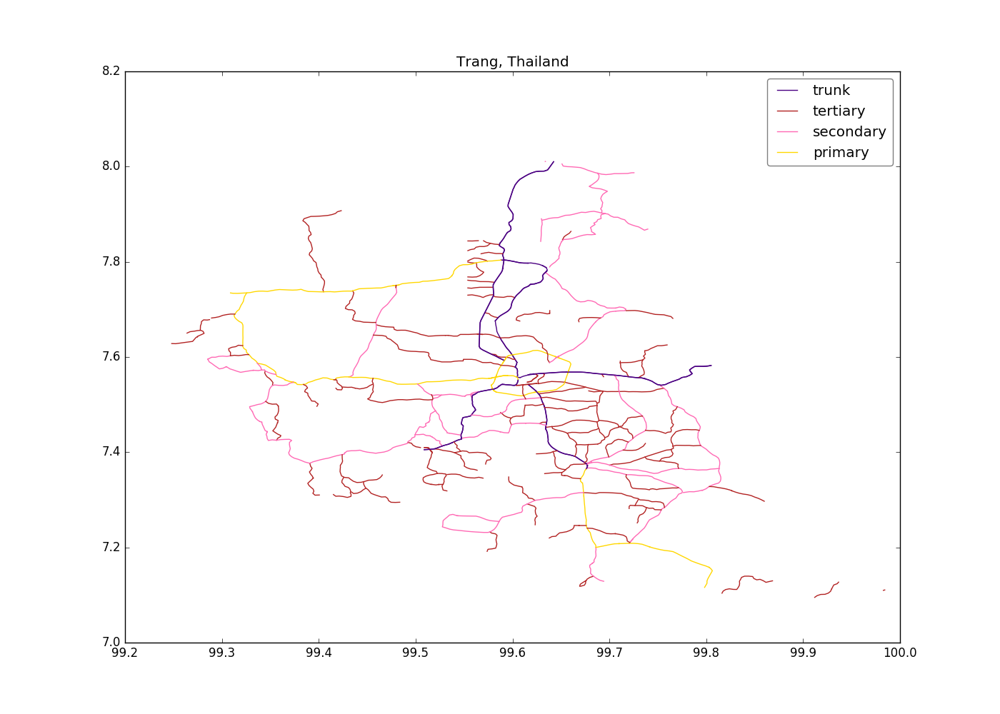
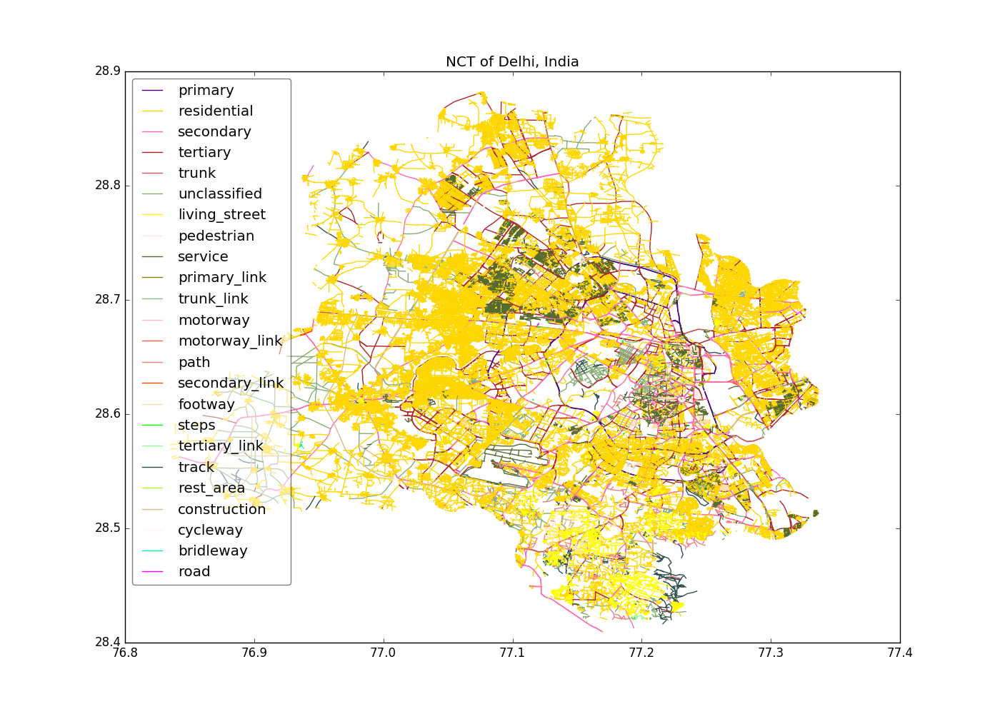
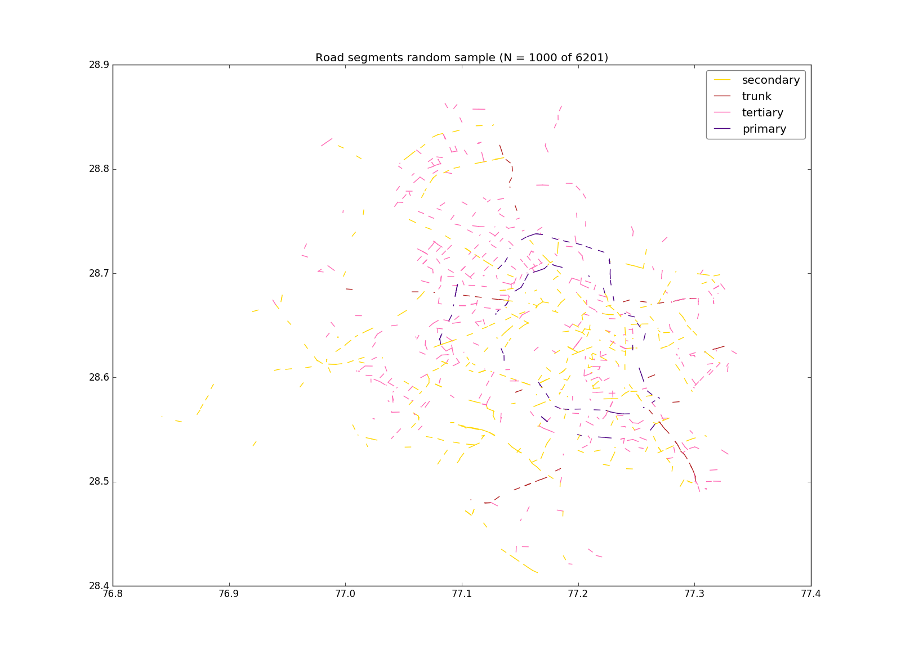
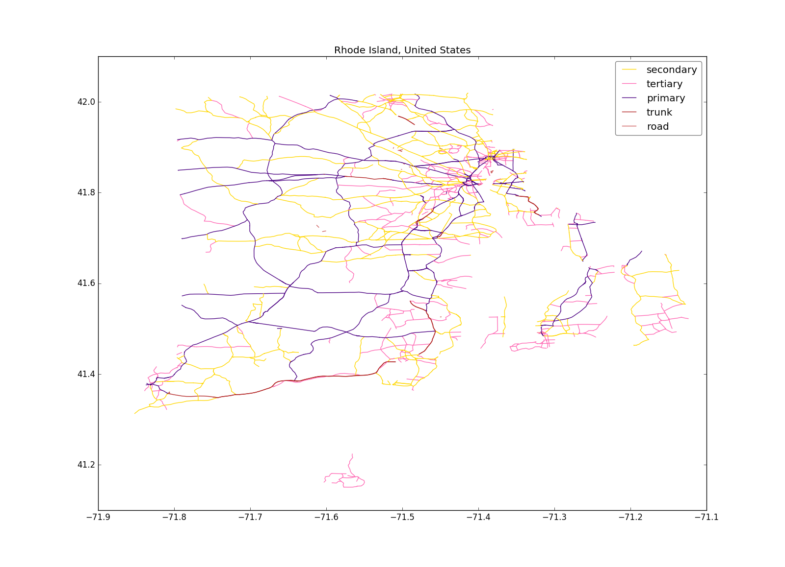
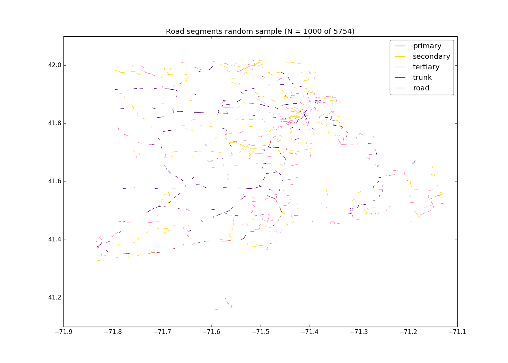
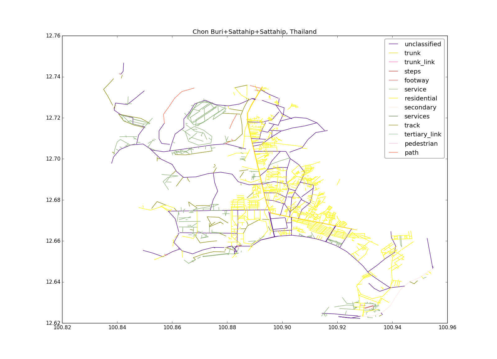

Usage
#####

geo_roads
---------

Get all the roads in a specific region from OpenStreetMap.

::

	usage: geo_roads.py [-h] [-c COUNTRY] [-l {1,2,3,4}] [-n NAME]
	                    [-t TYPES [TYPES ...]] [-o OUTPUT] [-d DISTANCE]
	                    [--no-header] [--plot]

	Geo roads data

	optional arguments:
	  -h, --help            show this help message and exit
	  -c COUNTRY, --country COUNTRY
	                        Select country
	  -l {1,2,3,4}, --level {1,2,3,4}
	                        Select administrative level
	  -n NAME, --name NAME  Select region name
	  -t TYPES [TYPES ...], --types TYPES [TYPES ...]
	                        Select road types (list)
	  -o OUTPUT, --output OUTPUT
	                        Output file name
	  -d DISTANCE, --distance DISTANCE
	                        Distance in meters to split
	  --no-header           Output without the header
	  --plot                Plot the output

  
Output File Format
******************

#. *segment_id* - Unique ID (record number)

#. *osm_id* - ID from Open Street Map data

#. *osm_name* - Name from Open Street Map data (road name)

#. *osm_type* - Type from Open Street Map data (road type)

#. *start_lat* and *start_long* - Line segment start position (lat/long)

#. *end_lat* and *end_long* - Line segment end position (lat/long)

Examples
********

To get a list of all the country names:

::

    geo_roads

To get a list of all boundary names of Thailand at a specific administrative level:

::

    geo_roads -c Thailand -l 1

In this case, all boundary names (77 provinces) at the 1st `administrative divisions level <https://en.wikipedia.org/wiki/Table_of_administrative_divisions_by_country>`_ of Thailand will be listed.

To get road data for the ``Trang`` province (only `trunk`, `primary`, `secondary` and `tertiary` road types):

::

    geo_roads -c Thailand -l 1 -n Trang -t trunk primary secondary tertiary --plot

By default, the output will be saved in ``output.csv`` and all the road segments will be plotted if *--plot* is specified

To run the script for ``Delhi, India`` and to save the output as ``delhi-roads.csv``: 

::

    geo_roads -c India -l 1 -n "NCT of Delhi" -o delhi-roads.csv --plot

By default, all road types will be outputted if `--types, -t` is not specified.

sample_roads
------------

Get a random sample of road segments, of all roads or specific road types.

::

	usage: sample_roads.py [-h] [-n SAMPLES] [-t TYPES [TYPES ...]]
	                            [-o OUTPUT] [--no-header] [--plot]
	                            input

	Random sample road segments

	positional arguments:
	  input                 Road segments input file

	optional arguments:
	  -h, --help            show this help message and exit
	  -n SAMPLES, --n-samples SAMPLES
	                        Number of random samples
	  -t TYPES [TYPES ...], --types TYPES [TYPES ...]
	                        Select road types (list)
	  -o OUTPUT, --output OUTPUT
	                        Sample output file name
	  --no-header           Output without the header
	  --plot                Plot the output

Examples
********

To get a random sample of 1,0000 road segments of road types `primary`, `secondary`, `tertiary` and `trunk`: 

::

    sample_roads -n 1000 -t primary secondary tertiary trunk -o delhi-roads-s1000.csv delhi-roads.csv

To get specific road types for Rhode Island in the US:

::

	geo_roads -c "United States" -l 1 -n "Rhode Island" -t trunk primary secondary tertiary road -o rhode-island-roads.csv --plot

And then get a random sample of 1,000:

::

	sample_roads -n 1000 -o rhode-island-s1000.csv --plot rhode-island-roads.csv

To get a specific region at 3rd adm. level (Tambon) of Thailand (e.g. "Tambon Sattahip, Amphoe Sattahip, Chon Buri, Thailand"):

::

	geo_roads -c Thailand -l 3 -n "Chon Buri+Sattahip+Sattahip" -o sattahip-roads.csv --plot

