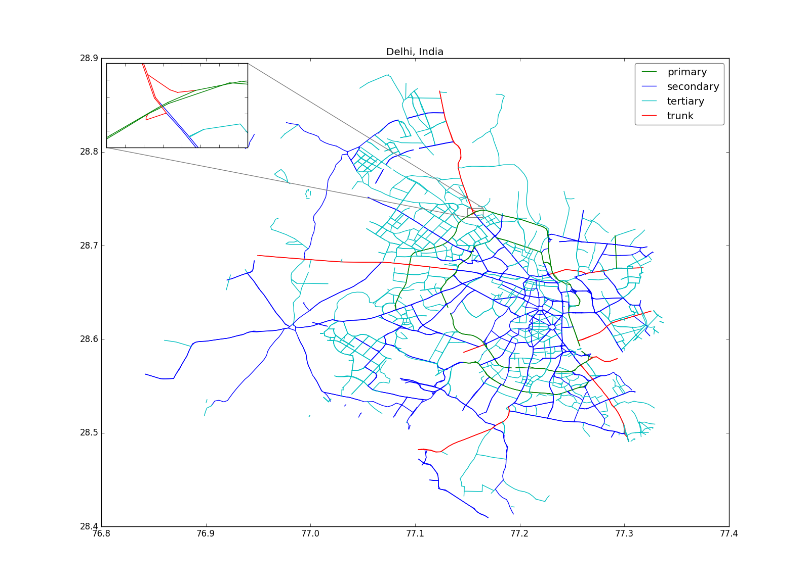

Workflow
###############

1) Start by downloading the administrative boundary data for the country in ESRI format from http://www.gadm.org/ country. For more information about administrative divisions of different countries, see https://en.wikipedia.org/wiki/Table_of_administrative_divisions_by_country There are multiple administrative levels --- cities may be nested in states which may be nested in countries.

2) Using `pyshp package <https://pypi.python.org/pypi/pyshp>`_  load 2nd level shapefile (IND_adm2.dbf and IND_adm2.shp), extract polylines of "NCT of Delhi" and build map data extract URL for http://extract.bbbike.org like the one for |delhi_link|.

  .. |delhi_link| raw:: html

    <a href="http://extract.bbbike.org/?city=delhi&sw_lng=76.8329162598&format=shp.zip&ne_lng=77.3377380371&coords=77.327%2C28.685%7C77.325%2C28.683%7C77.318%2C28.679%7C77.318%2C28.672%7C77.315%2C28.663%7C77.315%2C28.651%7C77.313%2C28.647%7C77.311%2C28.645%7C77.314%2C28.643%7C77.321%2C28.636%7C77.330%2C28.631%7C77.334%2C28.627%7C77.337%2C28.622%7C77.338%2C28.617%7C77.336%2C28.609%7C77.333%2C28.607%7C77.328%2C28.605%7C77.317%2C28.600%7C77.310%2C28.599%7C77.307%2C28.597%7C77.295%2C28.582%7C77.294%2C28.580%7C77.294%2C28.567%7C77.295%2C28.561%7C77.303%2C28.550%7C77.311%2C28.544%7C77.315%2C28.541%7C77.322%2C28.536%7C77.331%2C28.524%7C77.334%2C28.521%7C77.337%2C28.516%7C77.338%2C28.509%7C77.334%2C28.511%7C77.329%2C28.508%7C77.327%2C28.503%7C77.322%2C28.499%7C77.315%2C28.495%7C77.307%2C28.491%7C77.301%2C28.490%7C77.296%2C28.491%7C77.286%2C28.496%7C77.278%2C28.498%7C77.271%2C28.497%7C77.260%2C28.488%7C77.254%2C28.486%7C77.243%2C28.485%7C77.237%2C28.480%7C77.232%2C28.476%7C77.228%2C28.470%7C77.226%2C28.464%7C77.226%2C28.460%7C77.233%2C28.459%7C77.240%2C28.454%7C77.243%2C28.447%7C77.244%2C28.442%7C77.243%2C28.434%7C77.241%2C28.429%7C77.223%2C28.419%7C77.215%2C28.416%7C77.206%2C28.413%7C77.195%2C28.413%7C77.179%2C28.412%7C77.166%2C28.408%7C77.154%2C28.421%7C77.152%2C28.428%7C77.142%2C28.436%7C77.131%2C28.439%7C77.124%2C28.439%7C77.118%2C28.442%7C77.113%2C28.450%7C77.109%2C28.457%7C77.106%2C28.466%7C77.103%2C28.470%7C77.102%2C28.476%7C77.103%2C28.483%7C77.108%2C28.494%7C77.104%2C28.497%7C77.090%2C28.505%7C77.086%2C28.511%7C77.072%2C28.520%7C77.067%2C28.521%7C77.057%2C28.514%7C77.049%2C28.515%7C77.042%2C28.519%7C77.033%2C28.528%7C77.020%2C28.533%7C77.016%2C28.533%7C77.006%2C28.543%7C77.000%2C28.542%7C76.996%2C28.537%7C76.998%2C28.532%7C77.005%2C28.529%7C77.011%2C28.524%7C77.011%2C28.518%7C77.006%2C28.514%7C76.990%2C28.520%7C76.977%2C28.524%7C76.968%2C28.528%7C76.945%2C28.514%7C76.933%2C28.516%7C76.923%2C28.519%7C76.908%2C28.515%7C76.897%2C28.518%7C76.894%2C28.516%7C76.887%2C28.511%7C76.879%2C28.509%7C76.874%2C28.514%7C76.879%2C28.524%7C76.876%2C28.528%7C76.859%2C28.542%7C76.857%2C28.548%7C76.838%2C28.557%7C76.833%2C28.583%7C76.835%2C28.591%7C76.850%2C28.590%7C76.855%2C28.592%7C76.861%2C28.603%7C76.878%2C28.638%7C76.894%2C28.633%7C76.897%2C28.633%7C76.904%2C28.638%7C76.910%2C28.638%7C76.924%2C28.629%7C76.926%2C28.629%7C76.934%2C28.638%7C76.918%2C28.653%7C76.917%2C28.657%7C76.923%2C28.669%7C76.930%2C28.674%7C76.943%2C28.675%7C76.947%2C28.677%7C76.946%2C28.683%7C76.948%2C28.688%7C76.950%2C28.694%7C76.954%2C28.701%7C76.955%2C28.705%7C76.951%2C28.710%7C76.941%2C28.717%7C76.951%2C28.736%7C76.949%2C28.742%7C76.950%2C28.747%7C76.947%2C28.751%7C76.938%2C28.760%7C76.947%2C28.774%7C76.944%2C28.779%7C76.942%2C28.788%7C76.943%2C28.795%7C76.937%2C28.804%7C76.937%2C28.809%7C76.942%2C28.821%7C76.948%2C28.818%7C76.956%2C28.820%7C76.958%2C28.830%7C76.961%2C28.832%7C76.971%2C28.825%7C76.974%2C28.826%7C76.980%2C28.837%7C76.983%2C28.839%7C76.990%2C28.839%7C77.007%2C28.835%7C77.019%2C28.837%7C77.025%2C28.836%7C77.032%2C28.837%7C77.038%2C28.853%7C77.050%2C28.873%7C77.066%2C28.873%7C77.070%2C28.880%7C77.076%2C28.885%7C77.083%2C28.875%7C77.099%2C28.872%7C77.107%2C28.868%7C77.110%2C28.866%7C77.129%2C28.865%7C77.135%2C28.858%7C77.136%2C28.853%7C77.134%2C28.845%7C77.139%2C28.842%7C77.142%2C28.842%7C77.151%2C28.848%7C77.160%2C28.857%7C77.165%2C28.861%7C77.184%2C28.862%7C77.187%2C28.867%7C77.193%2C28.865%7C77.200%2C28.865%7C77.205%2C28.863%7C77.208%2C28.860%7C77.211%2C28.855%7C77.211%2C28.845%7C77.217%2C28.835%7C77.214%2C28.813%7C77.195%2C28.815%7C77.194%2C28.802%7C77.197%2C28.795%7C77.203%2C28.789%7C77.208%2C28.787%7C77.213%2C28.786%7C77.218%2C28.788%7C77.225%2C28.788%7C77.222%2C28.784%7C77.217%2C28.782%7C77.221%2C28.778%7C77.229%2C28.772%7C77.238%2C28.759%7C77.246%2C28.757%7C77.248%2C28.758%7C77.253%2C28.753%7C77.252%2C28.746%7C77.256%2C28.740%7C77.260%2C28.738%7C77.266%2C28.739%7C77.271%2C28.738%7C77.277%2C28.734%7C77.281%2C28.730%7C77.284%2C28.724%7C77.284%2C28.719%7C77.285%2C28.712%7C77.293%2C28.710%7C77.296%2C28.713%7C77.301%2C28.717%7C77.306%2C28.718%7C77.317%2C28.717%7C77.323%2C28.716%7C77.322%2C28.712%7C77.320%2C28.704%7C77.321%2C28.700%7C77.328%2C28.692%7C77.327%2C28.685&sw_lat=28.4084606171&ne_lat=28.8845119476" target="_blank">Delhi</a>

  This is so that we don't need to set up our own OSM map server, which is extremely large.

  Get link to the extracted map data by e-mail or check the download status page: http://download.bbbike.org/osm/extract/

3) Download and unzip it. There is a shapefile for road data in roads.*. Optionally we can drag and drop roads.* to view on http://www.mapshaper.org/. You'll see all roads map like this:

  .. image:: _images/india-delhi-roads-plot-all.png

  There are many types of roads found in the map data: 'primary', 'pedestrian', 'bridleway', 'secondary_link', 'tertiary', 'primary_link', 'service', 'residential', 'motorway_link', 'cycleway', 'secondary', 'living_street', 'track', 'motorway', 'construction', 'tertiary_link', 'trunk', 'path', 'trunk_link', 'rest_area', 'footway', 'unclassified', 'steps', and 'road'

4) Filter a few interesting road types and plot with matplotlib:

5) Iterate through all selected road types and split the polyline into 500 meters segments. The following figure plots segmented polylines :-

6) Write out all the segments to a CSV file.

